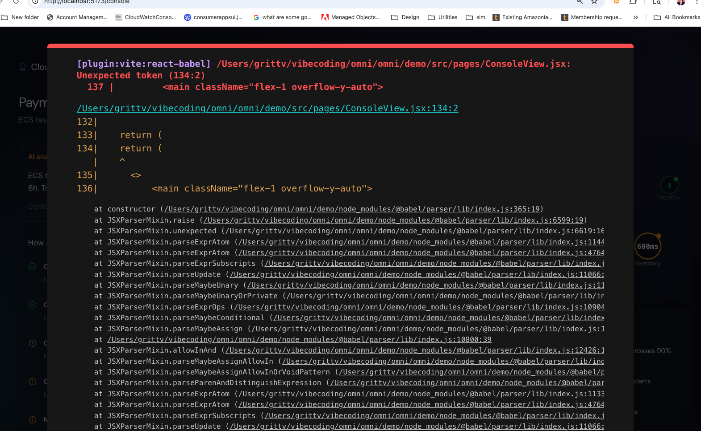

# SRE Workflows

The SRE's role is shifting from "do the work" to "direct the AI agents." These two workflows show how that plays out across devices.

---

## 🌙 The 2AM Flow — Something's broken, fix it fast

This is the fire drill. The SRE is half-asleep and needs to understand what's wrong, how bad it is, and what to do — in under 5 minutes, without staring at dashboards.

### Watch (first 30 seconds)

**1. Alert hits your wrist.**
Your watch buzzes. No wall of text — just one plain sentence the AI wrote for you:

> "Payment service is 12x slower than normal. 3 other services are affected. Nothing was deployed recently."

**2. You see three things at a glance:**
- How bad is it? (severity)
- How far has it spread? (blast radius)
- What kind of problem is it? (infrastructure, application, or security)

**3. Two buttons: "Got it" or "Wake someone up."**
You tap "Got it" and head to your phone.

### Phone (next 2–5 minutes, still in bed)

**4. Your phone opens an incident brief — not a dashboard.**
The AI has already done the detective work and written it up in plain language:

> "Best guess: the payment service in east-2 ran out of database connections. Memory started spiking at 1:47am. Nothing was deployed in the last 6 hours. Incoming traffic looks normal. Confidence: high."

**5. You see a map of what's affected.**
A simple diagram shows which services are broken, which are struggling, and which are fine. You can see the chain reaction — where the problem started and where it spread.

**6. The AI shows its work.**
It's already been digging through logs, performance data, and request traces. You can see its reasoning step by step — not just "here's the answer" but "here's why I think this." You can trust it or challenge it.

**7. You tell it what to do.**
Tap a button or just say it: "Run the fix for connection pool exhaustion" or "Roll back the last config change." The AI agent executes the playbook.

### Laptop (only if needed)

**8. You open the console and the context is already there.**
No starting from scratch. Everything the AI found on your phone is waiting for you — the timeline, the hypothesis, the affected services.

**9. Need to dig deeper? The AI writes the queries for you.**
Instead of hand-typing complex search queries at 2AM, the AI suggests them. You review, tweak if needed, and run.

**10. Problem solved. AI writes the post-mortem draft.**
Once the fix is confirmed, the AI generates a first draft of the incident report — pre-filled with the timeline, what signals it found, and the root cause. You edit and publish, not write from scratch.

